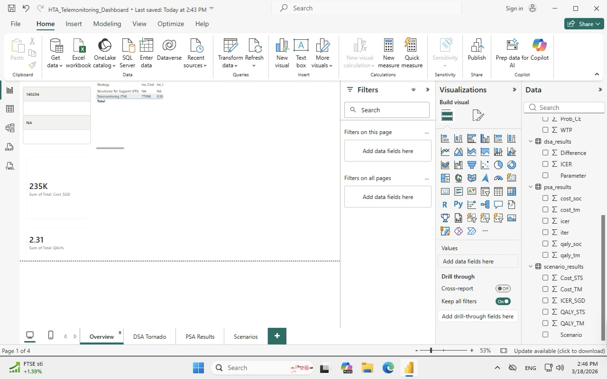
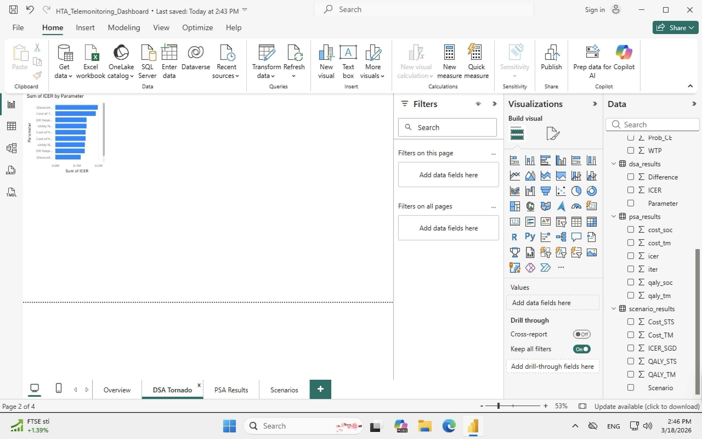
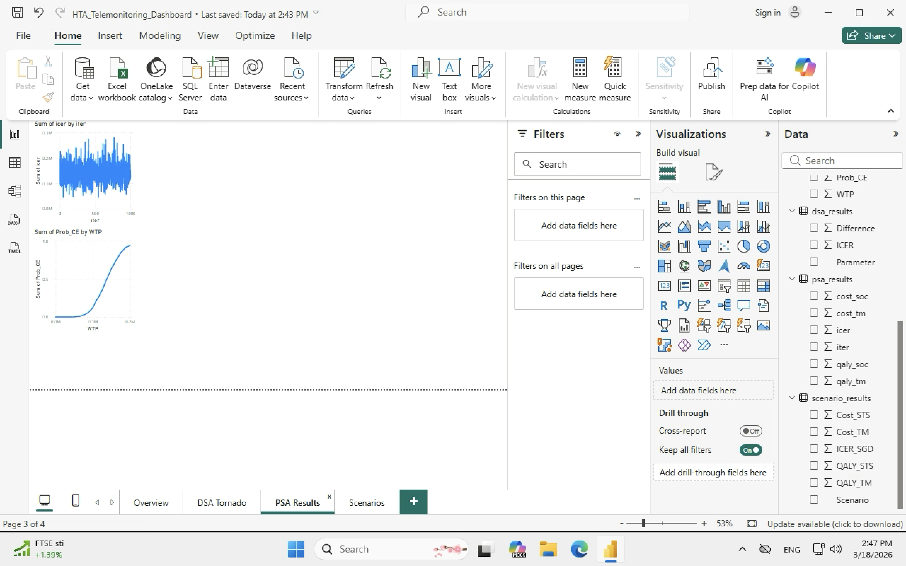
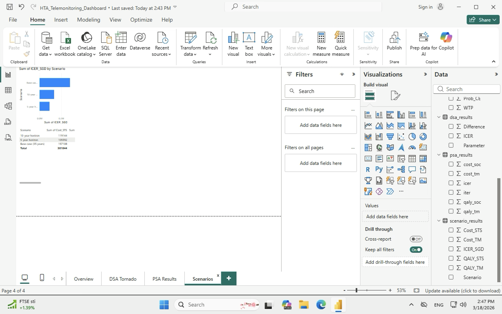

# Power-BI-data-visualization
This repository contains Power BI reports, datasets, and data visualization
# Power BI Data Visualization

This repository contains Power BI reports, datasets, and data visualization projects.

## HTA Telemonitoring Dashboard

A cost-effectiveness analysis dashboard comparing home telemonitoring versus structured telephone support for heart failure patients in Singapore. Built from a Markov model developed in R (see [hta-markov-model](https://github.com/lfangyu443-ui/hta-markov-model)).

### Overview — Base Case Results

### DSA Tornado Diagram

### PSA Results & CEAC

### Scenario Analyses

## Tools Used
- Power BI Desktop
- R (data source — Markov model outputs)
- MySQL (GUARDIAN database)
